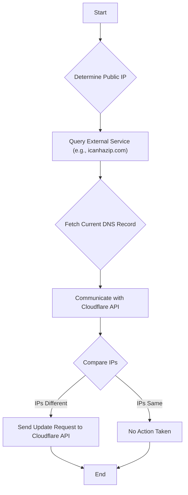

# Cloudflare DDNS


This project provides a simple containerized script to automatically update your Cloudflare DNS 'A' record with your current public IP address. It's designed to be lightweight and easy to deploy.


### How It Works

The `cloudflare-ddns` script automates the process of keeping your Cloudflare DNS A record updated with your dynamic public IP address. Here's a step-by-step breakdown of its operation:



## Usage

1.  **Run the Docker Container:**
    Run the container, passing in your Cloudflare credentials as environment variables. You can schedule this to run periodically using cron or a Kubernetes CronJob.

    ```bash
    docker run --rm \
      -e CLOUDFLARE_ZONE_ID="your_cloudflare_zone_id" \
      -e CLOUDFLARE_API_TOKEN="your_cloudflare_api_token" \
      -e CLOUDFLARE_RECORD_NAME="your.domain.com" \
      -e CLOUDFLARE_TTL="300" \
      -e CLOUDFLARE_PROXIED="true" \
      ghcr.io/prateekatam/cloudflare-ddns
    ```
    Replace the placeholder values with your actual Cloudflare details.
